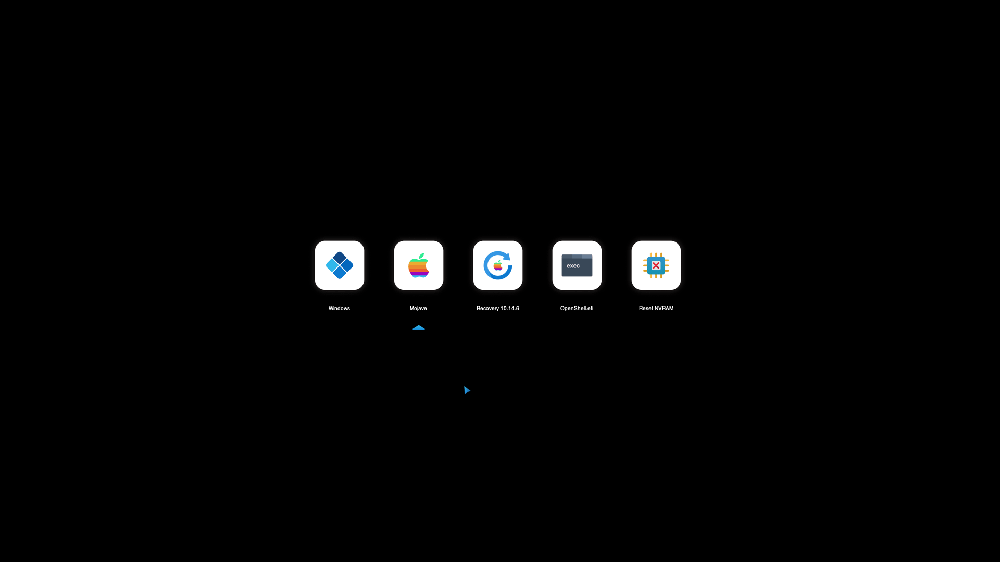

# OpenCanopy Icon Set

Hello guys, I make my own icon set of OpenCanopy. Currently, I've made 1 style hahah, inspired from Microsoft Fluent Design Style. Hope you enjoy my icon set

## Fluent Icon Style

## Note:
Make sure, you're using same version of OpenCanopy as your Opencore
