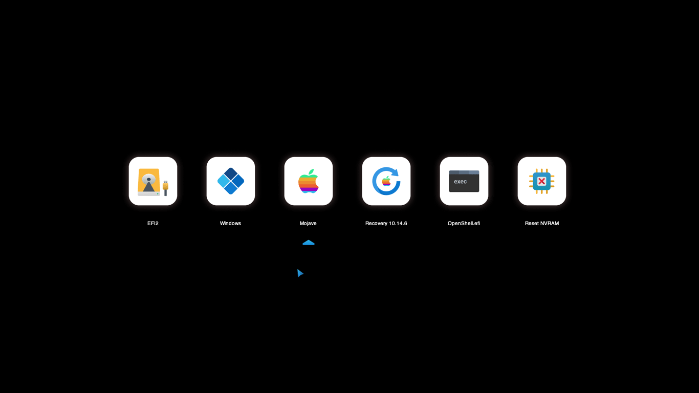
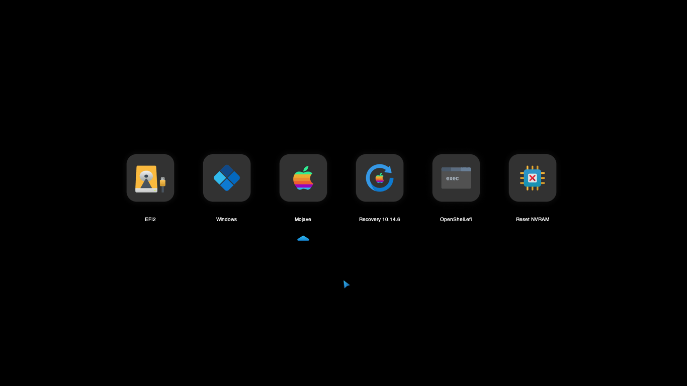

# OpenCanopy Icon Set

Hello guys, I make my own icon set of OpenCanopy. Currently, I've made 1 style hahah, inspired from Microsoft Fluent Design Style. Hope you enjoy my icon set

## Fluent Icon Style
There are 2 version, dark mode and light Mode

### Light Mode

### Dark Mode

## Note:
Make sure, you're using same version of OpenCanopy as your Opencore
